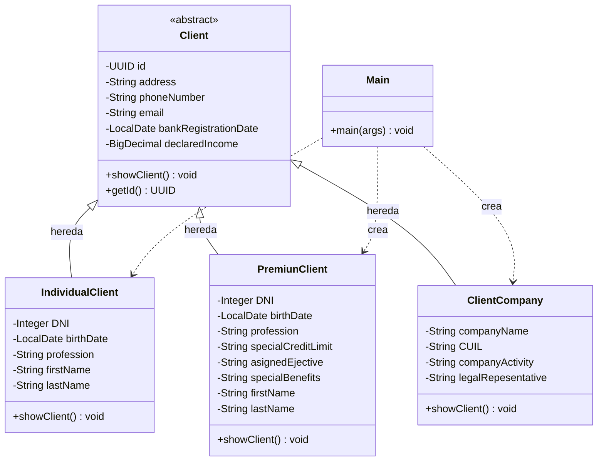

# Trabajo-Practico-Modelado-de-Clientes-Bancarios-utilizando-Programacion-Orientada-a-Objetos

Este es un sistema creado por Mikko Piaggio como trabajo práctico para la diplomatura en desarrollo fintech.
En la carpeta clientes se encuentran 4 clases que simulan ser 3 tipos de clientes en un sistema bancario y una clase base llamada cliente de la cual heredan estos clientes a la vez que agregan distintos atributos y metodos.

Mensión especial al profe Nico que explica muy bien.

## Diagrama de clases

El siguiente diagrama representa la jerarquía de clientes bancarios del proyecto.

### Explicación

`Client` es la clase abstracta que contiene los atributos comunes a todos los clientes:

- Identificador único.
- Dirección.
- Número de teléfono.
- Correo electrónico.
- Fecha de registro en el banco.
- Ingresos declarados.

Las clases `IndividualClient`, `PremiunClient` y `ClientCompany` heredan de `Client`. Cada una agrega los atributos específicos correspondientes a su tipo de cliente.

Todas las subclases sobrescriben el método `showClient()` para mostrar tanto la información heredada como sus datos particulares.

La clase `Main` crea y utiliza objetos de las tres clases concretas para comprobar su funcionamiento.

### Referencias del diagrama

- `+` indica un atributo o método público.
- `-` indica un atributo o método privado.
- `<|--` representa una relación de herencia.
- `..>` representa que una clase utiliza o crea objetos de otra clase.
- `<<abstract>>` indica que la clase es abstracta y no puede instanciarse directamente.

